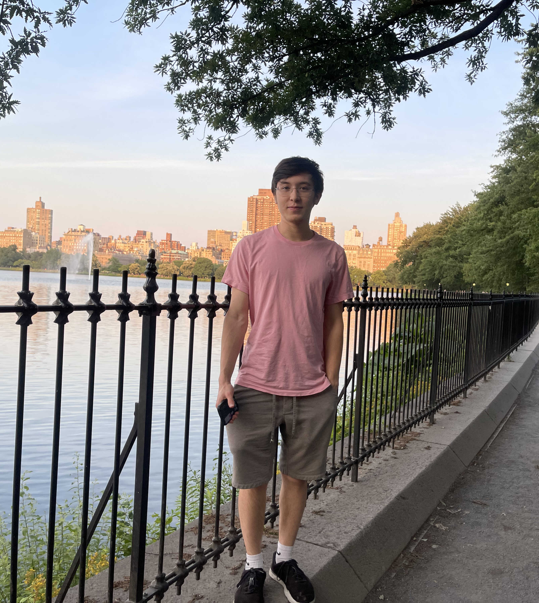

[[Resume](/assets/resume.pdf)]

## Some Quick Facts about Me
- I hope to build AGI
- I like compilers, computer architecture, LLMs, and agentic systems
- I enjoy reading AI papers daily
- My favorite languages are Python, Go, Rust, and C
- I'm a Technical Minecraft enthusiast
- I believe that less is more
- I use Arch btw

## Work Experience
- **Undergraduate AI Researcher** working under [Professor Chao Zhang](http://chaozhang.org/) (**August 2024 - present**)
- **AI Researcher** @ [DuckAI](https://duckai-site.netlify.app/) (**2023 - present**)
- **Junior AI Researcher** @ [Rialtic](https://www.rialtic.io/) (**2022 - 2023**)

## Education
- **CS (Intel + Sys-Arch) Undergrad** @ Georgia Tech (4.0 GPA) (**2023 - 2027**)
- **Governor Livingston High School** (4.76 GPA) (**2019 - 2023**)

## Notable Projects
- **DuckTrack**: Cross-platform, multimodal computer action data collector.  
  [GitHub](https://github.com/TheDuckAI/DuckTrack) | [Blog post](https://duckai-site.netlify.app/blog/ducktrack)
- **AI Photo Album**: Local photo album app that uses Meta’s [Imagebind](https://arxiv.org/abs/2305.05665) for accurate semantic search over video, audio, and images.  
  [GitHub](https://github.com/Broyojo/photo_album)
- **RecipeGPT**: GPT-4v based app that gives recipes using ingredients found from an image of an opened fridge. Submission for AIATL 2024.  
  [GitHub](https://github.com/Broyojo/recipegpt)
- **Bluebox**: 8-bit computer built from NOT gates.  
  [TUNGBOARD Files](https://github.com/Broyojo/bluebox-boards) | [Assembler](https://github.com/Broyojo/bluebox-assembler)
- **Hardware Minesweeper**: Original Microsoft Minesweeper completely built out of logic gates.  
  [Video](https://www.youtube.com/watch?v=BwxEGKpONMA)
- **Hardware Game of Life**: Conway’s Game of Life built entirely out of NOT gates.  
  [Video](https://youtu.be/YfB1EDpD8Cg?si=d-yAz3fFMwCpuwOG)

## Cool People I Work With
- [Aran Komatsuzaki](https://x.com/arankomatsuzaki)
- [Enrico Shippole](https://twitter.com/EnricoShippole)
- [Tom Sawada](https://www.linkedin.com/in/tom-sawada-16303220a/)
- [Jimmy Cushnie](https://twitter.com/jimmycushnie)
